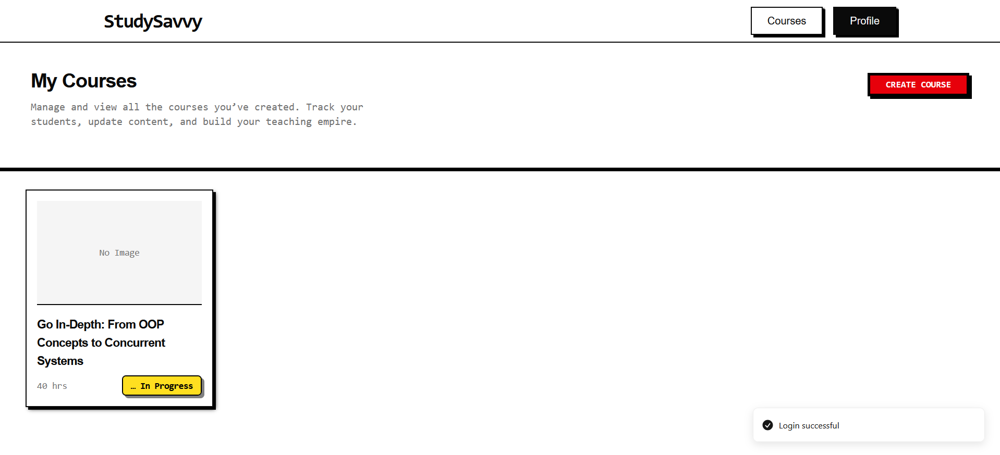
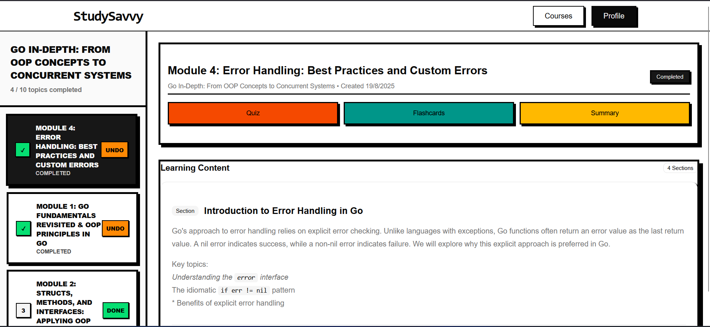
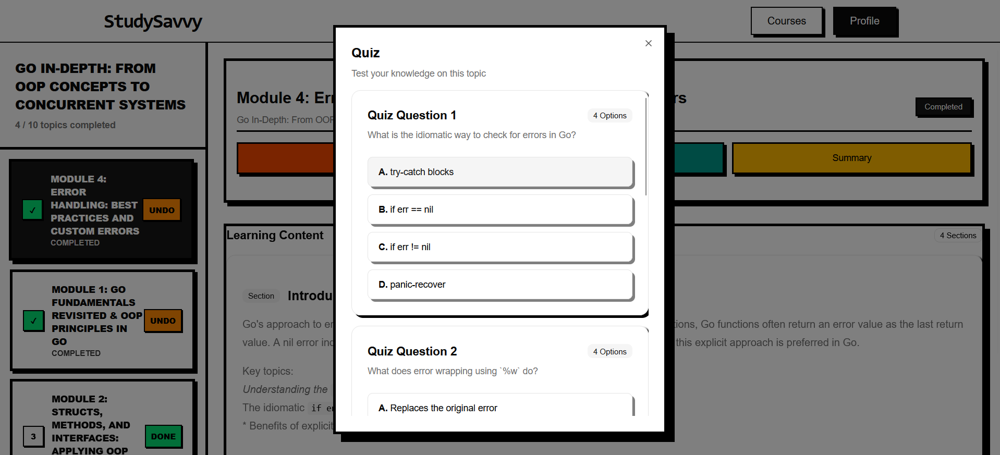
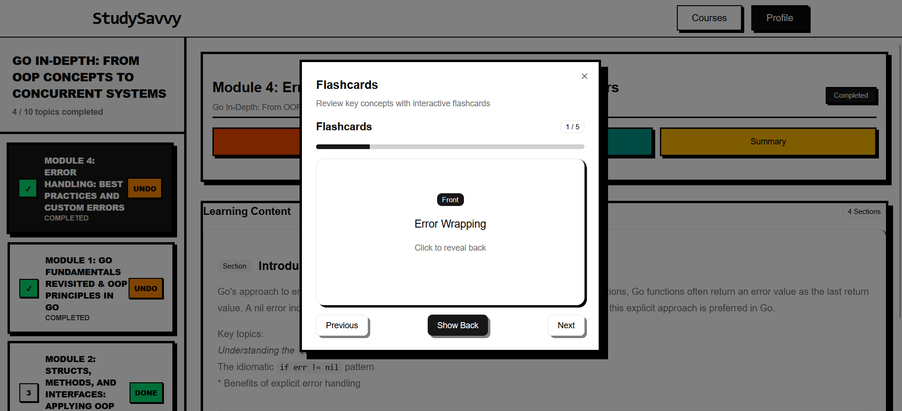

# StudySavvy

**Generate. Learn. Repeat. The AI way.**




## Overview

StudySavvy is an AI-powered learning platform that transforms your study materials into personalized courses, quizzes, flashcards, and summaries. Designed for students and educators, it leverages modern web technologies and generative AI to create a dynamic, adaptive learning experience.

## Tech Stack

- **Frontend:** React, TypeScript, Vite, TailwindCSS
- **Backend (BFF):** Node.js, Express, TypeScript, Prisma, PostgreSQL
- **AI Backend:** FastAPI (Python), LangChain, Google Gemini API
- **Other:** Radix UI, Lucide Icons, Sonner (toasts), Axios

## Features

- **AI Course Generation:** Instantly create structured courses from your content and preferences.
- **Interactive Quizzes:** Adaptive quizzes to test and reinforce your knowledge.
- **Flashcards:** Spaced repetition flashcards for optimal memory retention.
- **Summaries:** Concise, AI-generated topic and video summaries.
- **User Profiles:** Track your progress, skills, and completed courses.
- **Neo-brutalist UI:** Modern, bold, and accessible design.

## Project Structure

```
study-savvy/
├── bff-backend/         # Node.js/Express backend (API, DB)
├── fastapi-backend/     # Python FastAPI backend (AI/generation)
├── frontend/            # React + Vite frontend
```

## Getting Started

### Prerequisites

- Node.js (v18+)
- Python (3.10+)
- PostgreSQL

### Setup

#### 1. Backend (BFF)

```sh
cd bff-backend
npm install
npx prisma migrate dev
npm run dev
```

#### 2. AI Backend (FastAPI)

```sh
cd fastapi-backend
pip install -r requirements.txt
uvicorn app.main:app --reload
```

#### 3. Frontend

```sh
cd frontend
npm install
npm run dev
```

### Environment Variables

- Copy `.env.example` to `.env` in each folder and fill in required values (DB, API keys, etc).

## Usage

1. Register or log in.
2. Create a new course by uploading materials and specifying your learning goals.
3. Study with generated content, quizzes, flashcards, and summaries.
4. Track your progress on your profile page.

## Screenshots

### Home Page


### Course Page


### Quiz



### Flashcards



## License

MIT

---

*Built for the future of learning. Generate. Learn. Repeat.*

---

## Public Response

Check out the amazing response to our launch on [X (Twitter)](https://x.com/deepp2108/status/1957812543717810266?t=sO5d3GCVMHiKTz5F_Mte9A&s=09):  
Over 300 likes, 100 comments, with 15k views 